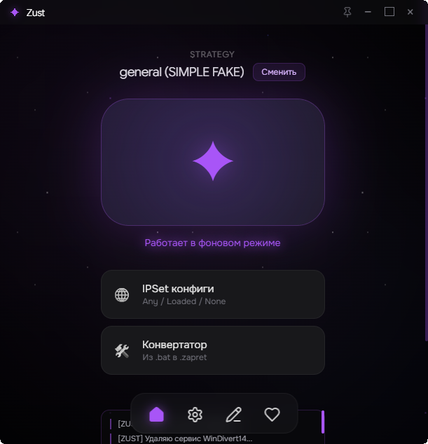
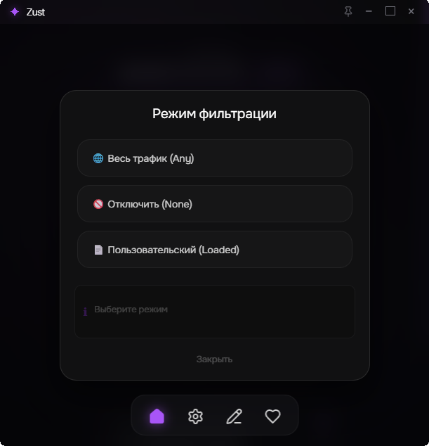

[rust.com]: https://img.shields.io/badge/rust-000000?style=for-the-badge&logo=rust&logoColor=white
[rust-url]: https://rust-lang.org/
[tauri.com]: https://img.shields.io/badge/TAURI-306090?style=for-the-badge&logo=tauri&logoColor=e2e318
[tauri-url]: https://v2.tauri.app/
[react.com]: https://img.shields.io/badge/REACT-FFFFFF?style=for-the-badge&logo=react&logoColor=00C8FF
[react-url]: https://react.dev/
[ts.com]: https://img.shields.io/badge/TypeScript-00C8FF?style=for-the-badge&logo=typescript&logoColor=white
[ts-url]: https://www.typescriptlang.org/

 

  
     <h1 align="center">ZuST [BETA]</h1> 

  

    Крайне простой интерфейс для работы с обходами блокировок.
     
    <a href="https://t.me/fizzeeen"><strong>Подписаться на меня <3</strong></a>
     
     
    <a href="#what-is-this">Что это?</a>
    &middot;
    <a href="https://github.com/f1zzen/zust/issues/new">Жалоба на баг</a>
  

  

[![rust][rust.com]][rust-url]
    [![tauri][tauri.com]][tauri-url]
    [![typescript][ts.com]][ts-url]
    [![react][react.com]][react-url]

  

> [!WARNING]
> ### BETA-ALERT ＼(º □ º l|l)/
> Проект находится в **BETA-РЕЖИМЕ!!**, и будет дополняться (и исправляться) по мере нахождения новых багов.
> Просьба информировать о найденных вами багах в личные сообщения [канала](https://t.me/fizzeeen) или сообщив об этом в [issues](https://github.com/f1zzen/zust/issues/new).

## Что это?

Пытаясь помочь людям с настройкой обхода блокировок, я столкнулся с кучей проблем и "непониманием": начиная от установки и заканчивая запуском. Люди не соображали, куда что нажимать и откуда скачивать... И даже с детальнейшей инструкцией появлялась гора вопросов и разных косяков. В качестве решения я решил объединить популярные методы обхода в одно приложение - ZuST (пока только zapret). Программа исправляет проблему десятки разных папок с запретом и собирает готовые решения для обхода в одной программе.

## Особенности

* **Синхронизация с zapret-discord-youtube от flowseal**. Если у вас включён запрет, вы это увидите в приложении.
* **Использование самостоятельных файлов**: вместо использования `.bat` файлов (как в `zapret-discord-youtube`) вы используете файлы с расширением `.zapret`, где включены лишь аргументы для запуска `winws.exe`. *(Для конвертации файлов достаточно нажать кнопку в меню)*
* **Возможность добавление пользовательских IPSet-ов**: добавляет возможность в использовании айписетов для обхода блокировок *(иногда добавить домен в list-general.txt недостаточно🥹)*
* **Ну и конечно, интуитивно понятный интерфейс** включая внутренний редактор, настройки и бла-бла-бла..

На данный момент довольно-таки пустовато.. Но пока проект находится в стадии **BETA**-тестирования, и будет доработан в ходе дальнейших нахождения проблем и бла-бла-бла. Текущий список на будущее:

- [ ] Добавить обход через hosts
- [ ] Автоматически обновлять bin-арники для zapret (включая стратегии)
- [ ] Добавить порт на линукс
- [ ] ..и по мелочам

## Мини-показ

    <table>
    <tr>
      <td></td>
      <td></td>
    </tr>
    </table>

## Дополнительно

> Проект распространяется на условиях лицензии [MIT](https://github.com/f1zzen/zust) 📝

> Огромная благодарность создателю [zapret](https://github.com/bol-van/zapret) | [bolvan](https://github.com/bol-van/) и [flowseal](https://github.com/Flowseal/) за [zapret-discord-youtube](https://github.com/Flowseal/zapret-discord-youtube/) ( ´ ꒳ ` ) ♡

> Для связи/поддержки проекта напишите в личные сообщения [каналу в Telegram](https://t.me/fizzeeen). o(>< )o
